<div align="center">

<!-- ✨ Animated Banner ✨ -->
<picture>
  <source media="(prefers-color-scheme: dark)" srcset="./dev-asik-banner-dark.svg?v=1">
  <source media="(prefers-color-scheme: light)" srcset="./dev-asik-banner.svg?v=1">
  
</picture>

</div>
  
<br/>


[](https://dev-asik.vercel.app)
[](https://github.com/UnfavAsik)
[](mailto:asik.devhub@gmail.com)

</div>

<br/>

## &#9642; About Me

```ts
const asikIkbal = {
  location: "Murshidabad, West Bengal, India",
  role: ["Full Stack Developer", "AI Developer", "UI/UX Designer"],
  brand: "Dev Asik",
  currentlyBuilding: ["dev-asik.vercel.app", "ProblemApp", "AXEL"],
  currentlyLearning: ["Advanced AI/LLM tooling", "3D motion & generative web design"],
  philosophy: "Build. Learn. Ship.",
};
```

- 🔭 Currently building **Asik AI** — a next-gen AI voice & chat assistant
- 🌱 Deep-diving into AI APIs, agentic workflows, and scalable system design
- 🎯 Obsessed with pixel-perfect, Apple × Vercel × Linear-inspired UI
- ⚽ Runs a football content brand & podcast for the OFC community
- 📍 Based in Murshidabad, West Bengal, India
- 💬 Reach me anytime at **asik.devhub@gmail.com**

<br/>

## 🧠 Tech Stack

<div align="center">

**Languages & Core**


<br>


**Frameworks & Libraries**


**Platforms & Tools**


**AI & APIs**


</div>

<br/>

## 🚀 Featured Projects

<div align="center">

| Project | Description | Stack |
|---|---|---|
| **[Dev Asik Portfolio](https://dev-asik.vercel.app)** | Personal portfolio & brand hub with dark glassmorphism UI | React · Vite · Tailwind · Firebase |
| **Asik AI** | Voice-first AI assistant with a hero avatar orb interface | React · AI APIs · WebRTC |
| **QuitPath** | Recovery & accountability app for Bengali-speaking users | React · Firebase · Anonymous Auth |
| **Campus Confession Hub** | Anonymous confession platform for college communities | React · Firestore · Realtime |

</div>

> Want the full case studies? Explore everything at **[dev-asik.vercel.app](https://dev-asik.vercel.app)**

<br/>

## 📊 GitHub Stats

<div align="center">

</div>

<div align="center">


</div>

<br/>

## 🗂️ Top Languages

<div align="center">

</div>

<br/>

## 📈 Contribution Graph

<div align="center">

</div>

<br/>

## 🐍 Contribution Snake

<div align="center">

<picture>
  <source media="(prefers-color-scheme: dark)" srcset="https://raw.githubusercontent.com/UnfavAsik/UnfavAsik/output/github-snake-dark.svg">
  <source media="(prefers-color-scheme: light)" srcset="https://raw.githubusercontent.com/UnfavAsik/UnfavAsik/output/github-snake.svg">
  
</picture>

<sub>Generated automatically by <code>github-snake.yml</code> via GitHub Actions on the <code>output</code> branch</sub>

</div>

<br/>

## 🏆 Achievements
<div align="center">

</div>

<div align="center">

</div>
<br/>

## 🤝 Connect With Me

<div align="center">

[](https://github.com/UnfavAsik)
[](https://dev-asik.vercel.app)
[](https://www.linkedin.com/in/asik-ikbal-6445a932b)
[](https://www.instagram.com/unfav_asik)
[](mailto:asik.devhub@gmail.com)

</div>

<br/>

<div align="center">

### 👁️ Profile Views


</div>

<br/>

<div align="center">

---

<sub>Designed &amp; built with ⚡ by <b>Dev Asik</b> — Full Stack Developer · AI Developer · UI/UX Designer</sub>
<br/>
<sub>© 2026 Asik Ikbal · <a href="https://dev-asik.vercel.app">dev-asik.vercel.app</a></sub>

</div>
